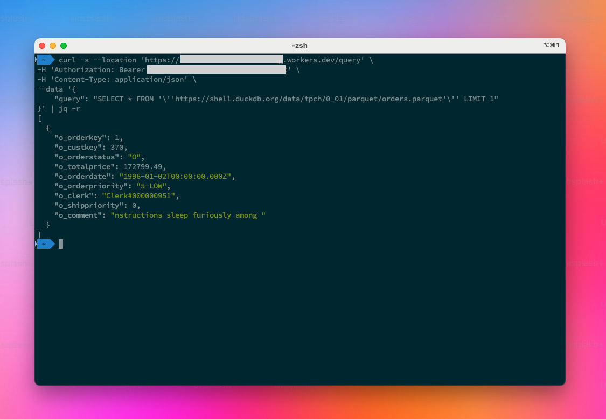

# cloudflare-duckdb
Running DuckDB on Cloudflare Containers as a Hono-based API.



## Build image locally
Before being able to build the Docker image locally, you have to download the DuckDB extensions we'd like to package into the image, so that they don't need to be downloaded on each container start:

```bash
scripts/download_extensions.sh
```

Once this is done, you can run the following to build the image locally:
```bash
docker build -t tobilg/cloudflare-duckdb . 
```

## Run the image locally
To run the newly built image locally, run

```bash
docker run --rm -it -p 3000:3000 tobilg/cloudflare-duckdb 
```

To query the DuckDB API within the running container, use

```bash
curl --location 'http://localhost:3000/query' \
--header 'Content-Type: application/json' \
--data '{
    "query": "SELECT * FROM '\''https://shell.duckdb.org/data/tpch/0_01/parquet/orders.parquet'\'' LIMIT 1000"
}'
```

**Hint:**
Currently it's not possible to use `wrangler dev` during local development. I guess this will eventually change once Containers become GA.

## Deployment
You need the most recent version of Wrangler on your machine, and **the Cloudflare account you want to deploy to needs to have Cloudflare Containers beta access**.

If those prerequirements are met, just do the following:

```bash
npm run deploy
```

This will push the Docker image to Cloudflare's registry, create a Workers-based API endpoint, as well as a DurableObject that manages/communicates with the container instances.

Once it's done, you can access the Workers API endpoint that gets shown from the command's output.

**Hint:** It's possible that it takes a few minutes until containers are available, and it's possible that you see some errors if you're hitting the API and it's not yet up.

## API
The Hono.js-based API offers a few endpoint:

* `GET /`: Will show a JSON welcome message
* `GET /_health`: Enables potential container health checking (currently not used)
* `POST /query`: Takes a `application/json` object body with a `query` property that contains the (encoded) SQL query. Returns the query result in `application/json` as well (see example above)
* `POST /streaming-query`: Takes a `application/json` object body with a `query` property that contains the (encoded) SQL query. Returns the query result a stremaing response as `application/vnd.apache.arrow.stream` 

### Securing the API
You can generate and deploy a Workers secret named `API_TOKEN` that will automatically be used to secure the `/query` and `/streaming-query` endpoints once it's present:

```bash
wrangler secret put API_TOKEN
```

and the add the generated secret value as prompted by the Wrangler CLI.
